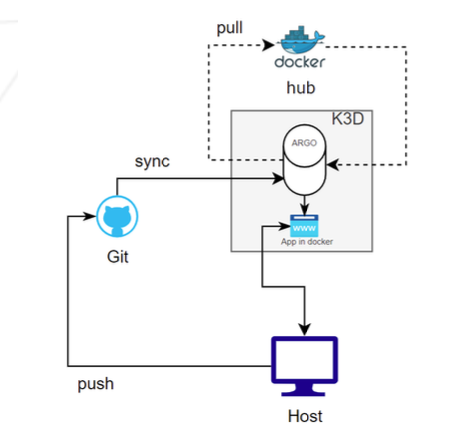

# I15s

## Description
This project aims to introduce you to Kubernetes from a developer's perspective. You will have to set up small clusters and discover the mechanics of continuous integration. At the end of this project, you will be able to set up a working cluster in Docker and have a usable continuous integration pipeline for your applications.

## Part 1: K3s and Vagrant

- Write you Vagrantfile using LTS of the distribution of your choice
- 1 CPU and 512 or 1024 MB of RAM
- VM-1 (server, controller node) ===> hostname: `tbouzalmS` , IP: 192.168.56.110 
- VM-2 (serverworker, agent mode) ===> hostname: `tbouzalmSW` , IP: 192.168.56.111  
- Be able to connect with SSH with no password.
- Install k3s on both machines

## Part 2: K3s and three simple applications

[Docker Containers vs. Kubernetes Pods - Taking a Deeper Look](https://labs.iximiuz.com/tutorials/containers-vs-pods)

[Kubernetes networking: service, kube-proxy, load balancing](https://learnkube.com/kubernetes-services-and-load-balancing#externaltrafficpolicy-local-preserving-the-source-ip-in-kubernetes)

https://loganmarchione.com/2022/03/k3s-single-node-cluster-for-noobs/

https://kubernetes.io/docs/reference/using-api/health-checks/

[Installing the Nginx Ingress Controller on K3S](https://medium.com/@alesson.viana/installing-the-nginx-ingress-controller-on-k3s-df2c68cae3c8)

## Part 3: K3d and Argo CD

- Install K3D on the virtual machine without using vagrant to create the VM.
>You will need Docker for K3d to work, and probably some other software as well. Therefore, you must write a script to install all the necessary packages and tools during your defense.

- Understand the difference between K3S and K3D

>k3d is a lightweight wrapper to run k3s (Rancher Lab’s minimal Kubernetes distribution) in docker.
k3d makes it very easy to create single- and multi-node k3s clusters in docker, e.g. for local development on Kubernetes.

- Create you first **continuous integration**

You have to create two namespaces:

- The first one will be dedicated to **Argo CD**.
- The second one will be named **dev** and will contain an application. This application will be automatically deployed by **Argo CD** using your online Github repository.

>Yes, indeed. You will have to create a public repository on Github where you will push your configuration files.
You are free to organize it the way you like. The only mandatory requirement is to put the login of a member of the group in the name of your repository.

